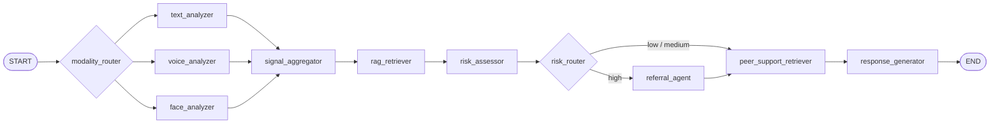

# 面向高校学生心理风险早期识别与转介辅助的多智能体协同系统

这是一个面向高校心理风险早期识别与规范转介的多智能体系统原型。当前版本已经全面升级为**多智能体（Multi-Agent）并行架构**，具备真实的 Fan-out/Fan-in 图拓扑，实现了文本、语音、端侧面部特征的并行分析与条件路由流转，同时提供标准聊天与视频通话两种交互模式。系统目标是辅助风险识别与流程转介，绝不替代专业心理咨询或医疗诊断。

当前建议把它视为“**可联调、可验证、可继续硬化的试点前版本**”。若要进入校内试点，建议先参考 [Project Hardening And Pilot Readiness Implementation Plan](docs/plans/2026-03-23-project-hardening-roadmap.md) 并优先完成持久化、审计和 CI 基建。

## 当前已完成核心特性

### 1. 多智能体架构 (Multi-Agent Graph)
重构了早期的线性流水线，当前 LangGraph 拓扑包含 9 个独立节点，实现了彻底的解耦：
- **Modality Fan-out**: `modality_router` 会根据输入模态自动并行触发 `text_analyzer`、`voice_analyzer` 和 `face_analyzer`。
- **Signal Fan-in**: `signal_aggregator` 汇集多模态分析结果。
- **RAG & Risk**: 融合历史相似案例后交由 `risk_assessor` 评估当前风险分数。
- **Conditional Referral**: 依据风险等级通过 `risk_router` 决定是否触发独立的 `referral_agent`。
- **Peer Support Style Alignment**: `peer_support_retriever` 可按需检索同辈倾听话术样例，为最终回复做风格对齐。
- **Response**: `response_generator` 生成温暖、同理心的回复。

精简版核心图如下，统一源文件见 [core-architecture-mermaid.md](docs/diagrams/core-architecture-mermaid.md)：



### 2. 音频到情绪的分析链路 (Audio-to-Emotion Pipeline)
- **多维度特征提取**: 依托 `librosa`、`scipy` 实现了 F0、RMS、Silence Ratio 等物理声学特征提取，且新增了 **MFCC（梅尔频率倒谱系数）** 处理。
- **异步非阻塞设计**: 音频处理 CPU 密集型任务已转入 `asyncio.to_thread`，无缝接入 FastAPI / WebSocket 异步事件流。
- **启发式情绪推断**: 规则化声学线索映射（如“低能量+平缓F0+大量停顿=低落线索”）。
- **LLM 语义判读**: 可选通过大模型对“声学特征字典”做快速的客观情绪观察。
- **并行深度 SER 增强**: 新增可选的 `emotion2vec_plus_large` 本地推理服务，结果以 `voice_signals["emotion2vec_reading"]` 独立字段并行写入，不替代现有 acoustic / MFCC / heuristic / LLM 链路。
- **状态可观测**: 前端 `TracePanel` 现可直接查看 emotion2vec 当前状态、标签、置信度、模型目录和错误信息，便于联调与排障。
- **强制可降级**: 当 `emotion2vec` 关闭、模型目录缺失、依赖不完整或推理失败时，节点会返回 `disabled` / `unavailable` / `error` 状态并自动回退到旧逻辑，不会破坏既有语音分析结果。

### 3. 会话记忆与双层 RAG
- LangGraph `MemorySaver` 进程内会话记忆与历史上下文维持。
- 新增内置 `file` checkpointer，可在单机环境下实现进程重启后的会话恢复；`memory` 仍作为开发/测试默认值。
- RAGFlow 外部相似案例库检索支持（挂载于 `rag_retriever` 独立节点）。
- 新增可选 `peer_support_retriever` 节点，可检索同辈倾听话术样例并写入 `peer_support_context`，供 `response_generator` 做风格对齐。
- 已补充本地 BGE-M3 embedding 联调脚本，可通过 OpenAI-compatible `/v1/embeddings` 接口接入 RAGFlow 的 LocalAI embedding 配置。
- RAGFlow Dify-compatible retrieval 请求会显式传入 `metadata_condition: null`，避免 RAGFlow 将空 metadata 条件误解释为过滤全部文档。
- 高风险评估时可结合历史相似案例提升判断合理性，外部依赖失败时支持平滑降级。

### 4. 端侧面部表情提取 (Edge AI Face Analysis)
- **纯本地推理**: 依托 `@mediapipe/tasks-vision` 在浏览器前端实现完全本地化处理。
- **隐私保护契约**: 原始视频画面绝不离开客户端，仅提取结构化的 FACS (Facial Action Coding System) AU 数据与复合情绪得分，通过独立的 WebSocket 定期同步后端。
- **1.25秒滑动窗口平滑**: 引入特征流滑动降噪（Average Pooling），控制网络压力并消除视频帧级别的高频抖动。
- **非诊断与辅助校准**: 提取的面部观察结果（如“用户持续皱眉”或“微弱微笑”）在输入 `risk_assessor` 节点时会被强制作为 *上下文轻度辅助校准（Contextual Calibration）* 处理，系统禁止单凭面部特征直接引发高危跳变。

### 5. 实时交互、视频通话与告警闭环
- 支持 REST (`/chat`) 与两条 WebSocket 链路：文本流式接口 (`/ws/chat/{session_id}`) 和语音流式接口 (`/ws/voice-chat/{session_id}`)。
- 前端提供标准聊天模式与视频通话模式：视频通话会自动拉起语音流、按需启用本地摄像头面部分析；语音输入回合会自动请求语音回复，视频通话中的文本和语音回合都会请求语音回复。
- 视频通话面板会保持本地 `<video>` 节点常驻，打开镜头时可稳定绑定浏览器摄像头流并供 MediaPipe 端侧面部分析复用；摄像头关闭时清空 `srcObject`，避免残留旧流。
- 后端默认接入阿里云百炼 `qwen3-tts-instruct-flash`，通过 SSE 流式返回句级音频分片；前端基于 `tts_audio` / `tts_end` 事件顺序播放，并兼容将流式 PCM 分片即时封装为浏览器可播的 WAV。
- DashScope LLM/TTS 调用会绕过本机代理环境变量，避免 `HTTPS_PROXY` 等本地代理导致 `dashscope.aliyuncs.com` TLS 连接被提前断开；TTS 在 DashScope 未产出音频时保留 `edge_tts` 降级路径。
- 语音 WebSocket 会先发送 `transcript` 事件，再进入 `stage` / `token` / `final` / `end` 回复链路；文本 WebSocket 则直接进入流式回复链路。
- 高风险会话不再通过冰冷模板提示，改为 `referral_agent` 输出极具同理心的温暖过渡语，并组装热线求助卡片。
- 对辅导员/后台同时提供脱敏后的同步调度状态与异步 Webhook 投递能力，便于校内值班系统对接。
- 发送给前端的 `trace` 包含解释性字段、风险校准、各 Agent 的内部判断、emotion2vec 状态摘要、RAG 检索命中状态，以及最新面部辅助观察结果。

### 6. 健壮的工程设施
- 所有重复状态访问和组装提取到 `app/utils/state_helpers.py`（符合 DRY 原则）。
- LLM 节点的系统提示词与 user prompt builder 已集中收敛到 `app/prompts/`，当前主流程 4 个节点与兼容旧节点 `information_extractor` 统一复用，便于后续维护、审查与版本化。
- 为高并发场景添加了 LangGraph 的安全并发写策略（自定义 `merge_dicts` reducer 解决 `agent_judgments` 写入竞争）。
- **自动化测试保障**：当前仓库测试目录中已包含 130 个后端 pytest 测试函数，覆盖路由器规则、各个独立 Node 回退链路、集中 prompt 管理、emotion2vec service 降级路径、WebSocket / Voice WS 事件契约、物理/MFCC 音频特征提取、Qwen 流式 TTS 回退与重试、DashScope 代理绕过、FACS 面部置信度聚合处理、同辈支持检索节点以及整个 Graph 整合运行；前端另有 26 个 `node:test` 纯逻辑用例覆盖 typewriter、语音 transcript 去重、语音回合自动播报、视频通话自动播报、摄像头预览挂载、RAG 检索状态展示，以及 PCM/WAV 播放适配逻辑。

---

## 目录结构

```text
app/
  api/routes/              # REST 与 WebSocket 接口
  core/config.py           # 环境变量与应用配置
  graph/                   # LangGraph 定义：state.py, routers.py, workflow.py
  models/                  # 接口输入输出 Schema
  nodes/                   # 9大独立 Agent 节点定义
  prompts/                 # LLM 节点提示词常量与 user prompt builder
  rag/                     # 检索增强逻辑
  services/                # 服务层：LLM, 告警, ASR, 声学特征(acoustic_feature_service)
  utils/                   # 共享状态修改函数与工具
frontend/                  # React + Tailwind 前端应用
tests/                     # pytest 测试用例 (包含 Graph、Nodes、Routers 和 Services 的单元测试)
```

## 环境配置

强烈推荐在 Conda 虚拟环境 `llm_env` 中运行：

```bash
conda create -n llm_env python=3.11
conda activate llm_env
pip install -r requirements.txt
```

请复制一份 `.env.example` 为 `.env` 并按需填写，关键项：
- `LLM_MODEL` 和 `LLM_BASE_URL` (兼容 OpenAI 接口风格，便于后续无缝切至本地 A40 部署的本地化模型)
- `LLM_API_KEY`
- `COUNSELOR_ALERT_WEBHOOK`
- `ENABLE_RAG` (设为 `false` 可在无 RAG 时本地测试纯 Agent 流转)
- `RAGFLOW_BASE_URL`、`RAGFLOW_API_KEY`、`RAGFLOW_DATASET_ID`（控制 RAGFlow 主知识库检索）
- `ENABLE_PEER_SUPPORT_RAG`、`RAGFLOW_PEER_SUPPORT_DATASET_ID`（控制同辈倾听话术检索开关与知识库）
- `CHECKPOINT_BACKEND` (`memory` / `file`，更高阶的 `postgres` / `redis` 预留给外部 saver 扩展)
- `CHECKPOINT_DIR` (当 `CHECKPOINT_BACKEND=file` 时生效)
- `TTS_ENABLED`、`TTS_PROVIDER`、`TTS_API_KEY`、`TTS_MODEL`、`TTS_BASE_URL`、`TTS_TIMEOUT_SECONDS`（当前推荐 `dashscope + qwen3-tts-instruct-flash` 流式 TTS）
- `TTS_QWEN_VOICE`、`TTS_QWEN_LANGUAGE_TYPE`（控制百炼 Qwen TTS 的系统音色与语言类型；当前联调使用 `Serena`，不传 instruction）
- `TTS_VOICE`、`TTS_RATE`、`TTS_VOLUME`、`TTS_OUTPUT_FORMAT`（仅在切回 `edge_tts` provider 时使用）
- `ENABLE_EMOTION2VEC` (默认 `true`；设为 `false` 可关闭本地 emotion2vec 辅助语音信号)
- `EMOTION2VEC_MODEL_DIR` (指向本地模型目录，如 `/media/chai/Data/Linux_AI_Resources/modelscope/hub/models/iic/emotion2vec_plus_large`)
- `EMOTION2VEC_SAMPLE_RATE` (默认 `16000`，与模型 README 保持一致)

启用 `emotion2vec` 时，当前仓库使用 **本地 ModelScope pipeline** 路径进行离线推理，`requirements.txt` 中已补充最小运行依赖：
- `modelscope`
- `datasets`
- `simplejson`
- `sortedcontainers`
- `addict`
- `funasr`
- `torch`
- `pillow`
- `torchaudio`

这里显式声明这些包，不是因为“本机刚好装过”，而是因为当前 `ModelScope` 的音频情感识别路径在运行时会实际依赖它们：`modelscope.pipelines` 会导入 `addict` 和 `Pillow`，`funasr` 会进一步依赖 `torch` 和 `torchaudio`。为了保证新机器按 `pip install -r requirements.txt` 就能复现，这些依赖必须写进仓库契约。

若本地模型目录不存在、依赖缺失或推理失败，系统会继续沿用原有传统声学特征链路，仅把 `voice_signals["emotion2vec_reading"]` 标记为 `unavailable` 或 `error`。
当前版本同时会把该状态同步写入前端可见的 `trace.emotion2vec` 字段，用于联调确认本地推理是否真正生效。

### 本地 BGE-M3 embedding 服务（RAGFlow LocalAI 联调）

如果 RAGFlow 的云端 embedding key 不可用，或需要完全本地化检索向量化，可先启动仓库内置的 OpenAI-compatible embedding 服务：

```bash
python scripts/bge_m3_embedding_server.py \
  --model-path /media/chai/Data/Linux_AI_Resources/modelscope/hub/models/BAAI/bge-m3 \
  --host 0.0.0.0 \
  --port 8001
```

健康检查：

```bash
curl -s http://127.0.0.1:8001/health
```

如果 RAGFlow 运行在 `docker_ragflow` 网络中，RAGFlow UI 的 LocalAI embedding 配置建议为：

```text
Model type: embedding
Model name: /app/models/bge-m3
Base url: http://172.18.0.1:8001
API-Key: 留空
Max Tokens: 8192
```

切换 embedding 模型后应新建测试知识库或重新解析原知识库，避免旧向量空间与新 embedding 模型不一致。

## 启动服务

### 后端 API (FastAPI)
```bash
conda activate llm_env
uvicorn app.main:app --host 0.0.0.0 --port 8000 --reload
```

### 前端 (Vite + React)
```bash
cd frontend
npm install
npm run dev -- --host 0.0.0.0
```
访问 `http://localhost:5173` 进行交互。

若要体验视频通话模式中的本地面部分析，请确认 `frontend/public/models/face_landmarker.task` 存在；当前仓库已包含该模型资产。

## 本地代码测试建议

项目当前同时维护后端 Pytest 与前端 `node:test` 级别的纯逻辑回归。开发或重构后，建议至少运行：
```bash
conda run -n llm_env python -m pytest -q --tb=short
node --test frontend/src/lib/typewriterStream.test.js frontend/src/hooks/useTTSPlaybackQueue.helpers.test.js frontend/src/hooks/useChatAgent.helpers.test.js frontend/src/hooks/useAudioStream.helpers.test.js
```
> 当前仓库测试目录中已包含 130 个后端 pytest 测试函数；前端补充 26 个 `node:test` 用例，覆盖 typewriter、语音 transcript 去重、语音回合自动播报、视频通话自动播报、摄像头预览挂载、RAG 检索状态展示、流式 assistant 收尾，以及流式 PCM 音频播放适配。

---

## 当前边界与后续计划

1. **持久化与持久会话**：当前仓库已内置 `file` checkpointer 作为单机持久化方案；下一步应接入 PostgreSQL/Redis 等真正的多实例持久化后端。
2. **本地模型挂载**：`BaseLLMClient` 抽象完全不变前提下，打通 A40 GPU 上的 Qwen2.5-72B 本地推理接口验证。
3. **真实多模态视频/音频**：`face_analyzer` 已接入端侧 MediaPipe FACS/AU 聚合结果并参与风险辅助校准；`voice_analyzer` 已接入可选 `emotion2vec_plus_large` utterance 级深度 SER 辅助信号，下一步可再扩展到更长时序、多脸场景和 segment 级建模。
4. **多重安全护栏**：声学特征与 emotion2vec 结果当前都仅做客观特征下发与“低危至中危”之间的适度调校，高危风险和警报坚持以文本模型理解与安全规则兜底。
