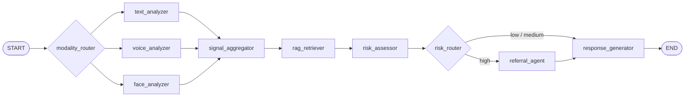

# 面向高校学生心理风险早期识别与转介辅助的多智能体协同系统

这是一个面向高校心理风险早期识别与规范转介的多智能体系统原型。当前版本已经全面升级为**多智能体（Multi-Agent）并行架构**，具备真实的 Fan-out/Fan-in 图拓扑，实现了文本、语音并行分析与条件路由流转。系统目标是辅助风险识别与流程转介，绝不替代专业心理咨询或医疗诊断。

当前建议把它视为“**可联调、可验证、可继续硬化的试点前版本**”。若要进入校内试点，建议先阅读 [Pilot MVP Contract](docs/pilot-mvp.md) 并完成持久化、审计和 CI 基建。

## 当前已完成核心特性

### 1. 多智能体架构 (Multi-Agent Graph)
重构了早期的线性流水线，当前 LangGraph 拓扑包含 8 个独立节点，实现了彻底的解耦：
- **Modality Fan-out**: `modality_router` 会根据输入模态自动并行触发 `text_analyzer`、`voice_analyzer` 和 `face_analyzer`。
- **Signal Fan-in**: `signal_aggregator` 汇集多模态分析结果。
- **RAG & Risk**: 融合历史相似案例后交由 `risk_assessor` 评估当前风险分数。
- **Conditional Referral**: 依据风险等级通过 `risk_router` 决定是否触发独立的 `referral_agent`。
- **Response**: `response_generator` 生成温暖、同理心的回复。

精简版核心图如下，统一源文件见 [core-architecture-mermaid.md](docs/diagrams/core-architecture-mermaid.md)：



### 2. 音频到情绪的分析链路 (Audio-to-Emotion Pipeline)
- **多维度特征提取**: 依托 `librosa`、`scipy` 实现了 F0、RMS、Silence Ratio 等物理声学特征提取，且新增了 **MFCC（梅尔频率倒谱系数）** 处理。
- **异步非阻塞设计**: 音频处理 CPU 密集型任务已转入 `asyncio.to_thread`，无缝接入 FastAPI / WebSocket 异步事件流。
- **启发式情绪推断**: 规则化声学线索映射（如“低能量+平缓F0+大量停顿=低落线索”）。
- **LLM 语义判读**: 可选通过大模型对“声学特征字典”做快速的客观情绪观察。
- **并行深度 SER 增强**: 新增可选的 `emotion2vec_plus_large` 本地推理服务，结果以 `voice_signals["emotion2vec_reading"]` 独立字段并行写入，不替代现有 acoustic / MFCC / heuristic / LLM 链路。
- **状态可观测**: 前端 `TracePanel` 现可直接查看 emotion2vec 当前状态、标签、置信度、模型目录和错误信息，便于联调与排障。
- **强制可降级**: 当 `emotion2vec` 关闭、模型目录缺失、依赖不完整或推理失败时，节点会返回 `disabled` / `unavailable` / `error` 状态并自动回退到旧逻辑，不会破坏既有语音分析结果。

### 3. 会话记忆与 RAG
- LangGraph `MemorySaver` 进程内会话记忆与历史上下文维持。
- 新增内置 `file` checkpointer，可在单机环境下实现进程重启后的会话恢复；`memory` 仍作为开发/测试默认值。
- RAGFlow 外部相似案例库检索支持（挂载于 `rag_retriever` 独立节点）。
- 高风险评估时可结合历史相似案例提升判断合理性，外部依赖失败时支持平滑降级。

### 4. 实时交互、闭环及告警
- 支持 RESTful (`/chat`) 及 WebSocket 流式接口 (`/ws/chat/{session_id}`, `/ws/voice-chat/{session_id}`)。
- 高风险会话不再通过冰冷模板提示，改为 `referral_agent` 输出极具同理心的温暖过渡语，并组装热线求助卡片。
- 对辅导员/后台的异步 Webhook 高风险脱敏告警。
- 发送给前端的 `trace` 包含解释性字段、校准基数、各 Agent 的内部判断，以及 emotion2vec 的显式状态摘要。

### 5. 健壮的工程设施
- 所有重复状态访问和组装提取到 `app/utils/state_helpers.py`（符合 DRY 原则）。
- 为高并发场景添加了 LangGraph 的安全并发写策略（自定义 `merge_dicts` reducer 解决 `agent_judgments` 写入竞争）。
- **自动化测试保障**：104 个 pytest 自动化测试通过，覆盖路由器规则、各个独立 Node 回退链路、emotion2vec service 降级路径、WebSocket trace 暴露、物理/MFCC 音频特征提取及整个 Graph 整合运行。

---

## 目录结构

```text
app/
  api/routes/              # REST 与 WebSocket 接口
  core/config.py           # 环境变量与应用配置
  graph/                   # LangGraph 定义：state.py, routers.py, workflow.py
  models/                  # 接口输入输出 Schema
  nodes/                   # 8大独立 Agent 节点定义
  rag/                     # 检索增强逻辑
  services/                # 服务层：LLM, 告警, ASR, 声学特征(acoustic_feature_service)
  utils/                   # 共享状态修改函数与工具
frontend/                  # React + Tailwind 前端应用
tests/                     # pytest 测试用例 (包含 Graph、Nodes、Routers 和 Services 的单元测试)
```

## 环境配置

强烈推荐在 Conda 虚拟环境 `llm_env` 中运行：

```bash
conda create -n llm_env python=3.11
conda activate llm_env
pip install -r requirements.txt
```

请复制一份 `.env.example` 为 `.env` 并按需填写，关键项：
- `LLM_MODEL` 和 `LLM_BASE_URL` (兼容 OpenAI 接口风格，便于后续无缝切至本地 A40 部署的本地化模型)
- `LLM_API_KEY`
- `COUNSELOR_ALERT_WEBHOOK`
- `ENABLE_RAG` (设为 `false` 可在无 RAG 时本地测试纯 Agent 流转)
- `CHECKPOINT_BACKEND` (`memory` / `file`，更高阶的 `postgres` / `redis` 预留给外部 saver 扩展)
- `CHECKPOINT_DIR` (当 `CHECKPOINT_BACKEND=file` 时生效)
- `ENABLE_EMOTION2VEC` (默认 `true`；设为 `false` 可关闭本地 emotion2vec 辅助语音信号)
- `EMOTION2VEC_MODEL_DIR` (指向本地模型目录，如 `/media/chai/Data/Linux_AI_Resources/modelscope/hub/models/iic/emotion2vec_plus_large`)
- `EMOTION2VEC_SAMPLE_RATE` (默认 `16000`，与模型 README 保持一致)

启用 `emotion2vec` 时，当前仓库使用 **本地 ModelScope pipeline** 路径进行离线推理，`requirements.txt` 中已补充最小运行依赖：
- `modelscope`
- `datasets`
- `simplejson`
- `sortedcontainers`
- `addict`
- `funasr`
- `torch`
- `pillow`
- `torchaudio`

这里显式声明这些包，不是因为“本机刚好装过”，而是因为当前 `ModelScope` 的音频情感识别路径在运行时会实际依赖它们：`modelscope.pipelines` 会导入 `addict` 和 `Pillow`，`funasr` 会进一步依赖 `torch` 和 `torchaudio`。为了保证新机器按 `pip install -r requirements.txt` 就能复现，这些依赖必须写进仓库契约。

若本地模型目录不存在、依赖缺失或推理失败，系统会继续沿用原有传统声学特征链路，仅把 `voice_signals["emotion2vec_reading"]` 标记为 `unavailable` 或 `error`。
当前版本同时会把该状态同步写入前端可见的 `trace.emotion2vec` 字段，用于联调确认本地推理是否真正生效。

## 启动服务

### 后端 API (FastAPI)
```bash
conda activate llm_env
uvicorn app.main:app --host 0.0.0.0 --port 8000 --reload
```

### 前端 (Vite + React)
```bash
cd frontend
npm install
npm run dev -- --host 0.0.0.0
```
访问 `http://localhost:5173` 进行交互。

## 本地代码测试建议

项目内置了详尽的 Pytest 体系来捍卫修改边界。开发或重构后，请运行：
```bash
conda activate llm_env
conda run -n llm_env python -m pytest -q --tb=short
```
> 当前主测试集为 104 个 pytest 用例，新增覆盖 emotion2vec service、配置读取、节点级降级、WebSocket trace 暴露与最小图契约。

---

## 当前边界与后续计划

1. **持久化与持久会话**：当前仓库已内置 `file` checkpointer 作为单机持久化方案；下一步应接入 PostgreSQL/Redis 等真正的多实例持久化后端。
2. **本地模型挂载**：`BaseLLMClient` 抽象完全不变前提下，打通 A40 GPU 上的 Qwen2.5-72B 本地推理接口验证。
3. **真实多模态视频/音频**：`face_analyzer` 当前仍为占位节点；`voice_analyzer` 已经接入可选 `emotion2vec_plus_large` utterance 级深度 SER 辅助信号，下一步可再扩展到 segment 级/时序级建模。
4. **多重安全护栏**：声学特征与 emotion2vec 结果当前都仅做客观特征下发与“低危至中危”之间的适度调校，高危风险和警报坚持以文本模型理解与安全规则兜底。
