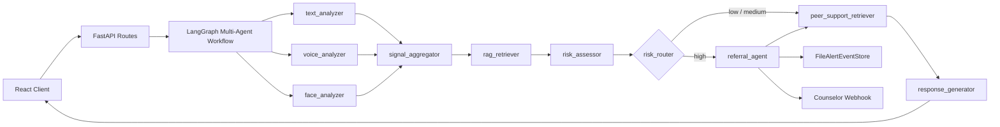

# 技术白皮书：面向高校学生心理风险早期识别与转介辅助的多智能体协同系统

版本：V1.7
日期：2026-05-25
代码基线：`feature/ci-smoke-checks` 分支 `41cb2cf`，待 PR #4 合入 `main`
文档定位：校内试点前技术说明、跨团队评审材料、研发交接入口

## 摘要

本项目是一套面向高校学生心理风险早期识别、支持性回应与规范转介辅助的多智能体系统。它以 FastAPI 和 LangGraph 为后端核心，以 React 为学生端交互界面，通过文本、语音和端侧面部辅助观察构建多模态风险视图，并在高风险场景下触发温和转介、热线卡片、脱敏告警与本地告警事件记录。

截至 2026-05-25，项目已经完成从“可演示多模态心理支持原型”到“试点前闭环工程基线”的关键推进：高风险事件已具备 file-backed 持久化模型，WebSocket 已暴露稳定的 `risk_event` 和 `final` 风险字段，风险评测 harness 已纳入 34 条 seed case 并修补明确高危漏报与非本人/否定/引用语境误报，GitHub Actions 与本地 smoke 命令已补齐。当前系统仍不是生产级校内工单系统；正式试点前还需要真实 SOP、管理员后台、生产级审计存储和部署硬化。

本系统明确不替代心理咨询师，不输出医学诊断结论，不提供治疗方案。它的价值在于把学生主动表达中的风险线索转化为可解释、可追踪、可复盘的辅助信息，并在高风险时尽早把人工支持接入流程。

## 1. 建设背景

高校心理支持场景具有几个典型难点：

- 学生风险表达常出现在夜间、匿名聊天、语音片段或碎片化倾诉中。
- 早期信号往往混杂在学业压力、关系冲突、睡眠问题和普通情绪宣泄里。
- 人工筛查在高并发、跨渠道和非工作时间场景下容易响应滞后。
- 真正的安全闭环不止是“模型判断 high”，还包括告警送达、人工接单、升级、回执和复盘。

本项目的设计目标是提供一个可嵌入校园心理支持流程的智能辅助底座：

1. 提取文本、语音和端侧面部结构化观察中的风险相关线索。
2. 汇聚多模态信号，避免单一线索被过度放大。
3. 结合 RAG 相似案例和规则兜底输出风险等级。
4. 对高风险强制触发转介、告警事件和温和支持资源。
5. 通过评测 harness、trace 和测试集保护风险策略迭代。

## 2. 项目边界

本系统坚持以下边界：

- 不做医学诊断。
- 不替代心理咨询或危机干预专业人员。
- 不生成药物建议或治疗方案。
- 不将语音或面部特征单独作为高风险判定依据。
- 不上传原始视频；前端只上传端侧提取的结构化面部特征。
- 风险评测 seed case 是工程 baseline，不是临床标签或专家审定结果。

高风险路径必须通过 `risk_assessor -> referral_agent`，最终对学生展示的文本统一由回复生成链路收口，避免把内部风控判断直接暴露成冰冷提示。

## 3. 系统架构

### 3.1 总体拓扑

系统由四层组成：

- 客户端层：React 聊天、语音、视频通话、Trace 面板和端侧 MediaPipe 面部分析。
- 接口层：FastAPI REST `/chat`、文本 WebSocket `/ws/chat/{session_id}`、语音 WebSocket `/ws/voice-chat/{session_id}`。
- Agent 图层：LangGraph 多节点 Fan-out/Fan-in 工作流。
- 外部与辅助服务层：LLM、RAGFlow、ASR、TTS、emotion2vec、告警 webhook、file checkpoint、file alert event store。



### 3.2 LangGraph 节点职责

`text_analyzer` 负责文本情绪和风险关键词提取。  
`voice_analyzer` 负责语音特征、MFCC、启发式声学观察和 emotion2vec 辅助结果整合。  
`face_analyzer` 负责消费端侧 FACS/AU、blendshape 和复合面部观察。  
`signal_aggregator` 负责统一多模态信号。  
`rag_retriever` 负责检索相似风险案例。  
`risk_assessor` 负责风险分级、规则兜底、LLM 判断和声学轻度校准。  
`referral_agent` 负责高风险温和转介、热线卡片、告警事件和 webhook。  
`peer_support_retriever` 负责同辈倾听话术检索。  
`response_generator` 负责最终回复和流式输出。

### 3.3 状态契约

系统使用 `PsychologyGraphState` 作为共享状态契约，涵盖：

- 会话与输入：`session_id`、`chat_history`、`user_profile`、`multimodal_features`
- 多模态信号：`text_signals`、`voice_signals`、`face_signals`、`extracted_signals`
- RAG：`reference_context`、`peer_support_context`
- 风险：`risk_level`、`current_risk_score`、`referral_required`
- 告警：`alert_event_id`、`alert_status`、`hotline_card`
- 输出：`reply`、`trace_id`、`agent_judgments`

并行节点写入通过自定义 reducer 合并 `agent_judgments`，避免 Fan-out 阶段状态竞争。

## 4. 多模态处理

### 4.1 文本

文本处理由 LLM prompt builder 与规则辅助共同完成。高危关键词和变体规则不会完全依赖模型输出；当出现明确自伤、结束生命、方法、准备行为等硬证据时，系统会按高风险兜底处理。

最新风险规则已补齐：

- 安眠药/吞药/药和水放在手边
- 从高处跳/跳下去
- 告别消息/遗书
- 明确伤害自己

同时加入上下文守卫，降低非本人、否定、歌词引用、新闻讨论、纯吐槽等语境误报。

### 4.2 语音

语音链路包括：

- `faster-whisper` ASR 转写。
- `librosa` / `scipy` 声学特征，包括 F0、RMS、silence ratio 和 MFCC。
- 启发式声学观察，例如低能量、停顿比例、激动线索。
- 可选 `emotion2vec_plus_large` 本地推理，结果写入 `emotion2vec_reading`。

语音特征只作为辅助校准。即使声学支持较强，也不能单独把低风险直接升为高风险。

### 4.3 端侧面部分析

前端基于 `@mediapipe/tasks-vision` 在浏览器本地提取面部结构化特征。后端只接收 AU/FACS、blendshape、复合情绪分数等结构化数据。

隐私边界：

- 原始视频不上传。
- 摄像头流只在浏览器本地使用。
- 面部特征只用于轻度上下文辅助，不单独触发高危。

### 4.4 RAG

系统支持两类 RAG：

- 风险案例 RAG：为 `risk_assessor` 提供相似案例上下文。
- 同辈支持话术 RAG：为 `response_generator` 提供表达风格参考。

RAGFlow 请求使用 Dify-compatible retrieval；外部服务失败时降级为空上下文，不阻断主流程。

## 5. 风险评估与安全策略

### 5.1 风险等级

系统输出三档风险：

- `low`：日常压力、普通低落、陪伴诉求、无明显功能崩解或自伤证据。
- `medium`：持续痛苦、睡眠/饮食/学习功能受损、回避、失控感，但无明确自伤或结束生命证据。
- `high`：明确自伤/自杀意图、方法、准备行为、遗书/告别、即时危险表达。

高风险会设置 `referral_required=true`，触发转介节点和告警事件。

### 5.2 高风险兜底与误报控制

`risk_assessor` 的策略是“高危不能漏，误报要被上下文守卫控制”：

- 高风险硬证据命中时直接升高。
- LLM 单独输出 high 但缺少高危证据时，不直接升 high。
- 出现否定自伤、非本人转述、歌词引用、新闻讨论、纯吐槽等语境时，阻止高危规则误触发。
- 若存在中风险功能受损关键词，同时带有否定自伤语境，则保留为 medium。

当前 seed case 暴露出的明确高危漏报与非本人/否定/引用误报已在短期内修补。非高危 low/medium 细分边界仍留待后续专家复核和产品策略调优。

## 6. 高风险告警事件

### 6.1 事件模型

高风险事件模型 `AlertEvent` 当前包含：

- `alert_event_id`
- `trigger_time`
- `updated_at`
- `masked_session_id`
- `risk_level`
- `latest_risk_evidence`
- `delivery_status`
- `ack_status`
- `handler_status`
- `trace_id`
- `summary`

状态字段当前取值：

- `delivery_status`: `created`、`delivered`、`delivery_failed`
- `ack_status`: `unacknowledged`、`acknowledged`
- `handler_status`: `created`、`acknowledged`、`in_progress`、`escalated`、`closed`

### 6.2 file-backed store

当前实现 `FileAlertEventStore` 使用 JSONL 文件保存事件，默认路径：

```text
.alert-events/alert-events.jsonl
```

设计取舍：

- 优点：不需要数据库迁移，适合短期试点前联调和本地回归。
- 限制：不适合多实例并发、正式审计、复杂查询或权限隔离。
- 后续：中期应迁移到 PostgreSQL 表，并接入管理员后台和审计时间线。

### 6.3 Webhook 投递

告警 webhook payload 会脱敏 `session_id`，使用 `masked_session_id`。Webhook 失败不会丢事件，事件会保留并标记 `delivery_failed`。

当前 `mock://` webhook 只用于本地联调。真实校内试点必须替换为学校确认的值班系统或告警通道。

## 7. 实时协议

### 7.1 REST

`POST /chat` 返回：

- `reply`
- `risk_level`
- `referral_required`
- `agent_judgments`
- `extracted_signals`
- `trace_id`
- `trace`
- `hotline_card`
- `alert_status`

### 7.2 文本 WebSocket

`WS /ws/chat/{session_id}` 事件包括：

- `stage`
- `token`
- `tts_audio`
- `tts_end`
- `risk_event`
- `final`
- `end`
- `error`

`risk_event` 仅高风险且存在 `alert_event_id` 时发送，并且在 `final` 前发送。

### 7.3 语音 WebSocket

`WS /ws/voice-chat/{session_id}` 在文本 WS 事件基础上额外发送：

- `transcript`

`transcript` 包含 segment id、起止时间、时长、转写文本和声学特征。空 transcript 会被跳过，避免生成空用户消息。

## 8. 前端

React 前端当前包含：

- 标准聊天界面。
- 语音输入与语音 WebSocket。
- 视频通话面板。
- 本地摄像头预览与端侧面部分析。
- TracePanel，用于展示 RAG、emotion2vec、风险校准和 Agent 判断。
- TTS 播放队列，支持 DashScope Qwen TTS 流式音频与 PCM/WAV 适配。

前端当前没有登录、角色权限、管理员后台或告警处理页面。它适合学生端联调和演示，不构成完整校内运营后台。

## 9. 数据与隐私

当前默认数据策略：

- 可保存完整对话文本和 ASR 转写，用于审计、复盘和风险策略改进。
- 默认不保存原始视频。
- 原始音频默认不长期保存。
- 保存必要声学特征、结构化面部观察、trace 摘要和告警事件。
- webhook 对外只发送脱敏会话标识、事件编号、风险级别、摘要和有限关键词。

建议试点默认保留策略：

- 完整对话文本和 ASR 转写：180 天。
- 高风险事件摘要、处置状态、管理员回执和时间线：3 年。
- 原始视频：不保存。
- 原始音频：默认不长期保存，除非伦理、法务和信息安全流程明确批准。

以上策略仍需校内心理中心、伦理、法务和信息安全团队确认。

## 10. 评测体系

### 10.1 当前资产

当前风险评测资产：

- `evals/risk_cases/risk_casebook_seed_v1.jsonl`
- `scripts/run_risk_eval.py`
- `tests/test_risk_eval_cases.py`

casebook 共 34 条，字段包括：

- `case_id`
- `input`
- `expected_risk_level`
- `expected_referral_required`
- `labels`
- `rationale`
- `review_status`

### 10.2 运行模式

`mock` 模式使用脚本内启发式规则。  
`node` 模式调用 `risk_assessor_node`，使用本地 stub LLM，不依赖真实 LLM 或 RAGFlow。

输出指标包括：

- `case_count`
- `correct_count`
- `accuracy`
- `high_recall`
- `false_positives`
- `false_negatives`
- 每条 case 的预测结果

### 10.3 当前结论

最新 node-level baseline：

- 34 条 seed case 中 31 条正确。
- 高危召回为 `1.000`。
- 高危 false positive / false negative 为空。
- 剩余错误集中在 medium 被判为 low 的非高危边界案例。

这些结果只能说明当前工程规则在 seed baseline 上没有已知高危漏报或高危误报，不代表临床有效性。

## 11. 工程验证

当前仓库维护：

- 后端 pytest：覆盖 API、WebSocket、LangGraph、节点、服务、RAGFlow、TTS、ASR、emotion2vec、告警事件、风险评测。
- 前端 node:test：覆盖 typewriter、TTS 播放队列、聊天 helper、语音 helper、视频面板 helper、TracePanel helper。
- 风险评测脚本：可输出 JSON 和 Markdown 报告。

常用命令：

```bash
conda run -n llm_env python -m pytest -q --tb=short
conda run -n llm_env python scripts/run_risk_eval.py --mode node
pnpm --dir frontend run test:node
pnpm --dir frontend run build
pnpm --dir frontend run lint
PYTHON_BIN=/path/to/env/python bash scripts/ci_check.sh
```

CI 入口位于 `.github/workflows/ci.yml`，包含后端 pytest、risk eval mock、前端 node tests、lint 和 build。GitHub runner 会安装 `libportaudio2`，同时 ASR 服务在 `sounddevice` 因缺少 PortAudio 抛出 `OSError` 时会按可选依赖不可用处理，避免 CI 收集阶段失败。

## 12. 部署与依赖

后端运行：

```bash
conda activate llm_env
python -m pip install -r requirements.txt
uvicorn app.main:app --host 0.0.0.0 --port 8000 --reload
```

前端运行：

```bash
cd frontend
pnpm install
pnpm run dev -- --host 0.0.0.0
```

主要可选外部依赖：

- 阿里云百炼 OpenAI-compatible LLM。
- DashScope `qwen-tts-latest`。
- RAGFlow。
- BGE-M3 本地 embedding 服务。
- faster-whisper ASR 模型。
- emotion2vec_plus_large 本地模型。

所有这些外部依赖都应具备降级路径。核心回归测试和风险评测 node/mock 模式不应依赖真实外部服务。

## 13. 当前限制

当前仍未完成：

- 生产级 PostgreSQL/Redis checkpoint。
- 正式数据库版告警事件表和会话审计表。
- 管理员后台、接单、升级、结案和回执。
- 真实校内 SOP、真实热线和真实值班系统。
- 登录、权限、多角色。
- Docker / docker-compose 部署。
- 专家审定风险样本集。
- 本地大模型路由与压测。

这些限制不会阻止本地演示和工程联调，但会阻止直接进入真实生产试点。

## 14. 路线图

### 短期：1-2 周

已完成：

- 文档基线校准。
- 高风险告警事件 file-backed store。
- WebSocket `risk_event` / `final` 风险契约。
- 风险评测 harness v0。
- 高危漏报和高危误报修补。
- CI/smoke checks。
- 前端统一 `test:node` 脚本。
- 本地 `scripts/ci_check.sh` 与 GitHub Actions。

### 中期：1-2 个月

- PostgreSQL checkpoint 与审计存储。
- 单一管理员后台。
- 告警事件状态机的真实操作接口。
- 真实校园资源和 SOP 接入。
- 数据保存、访问、导出和删除策略落地。
- 运营指标和 trace 可观测性。

### 长期：3-6 个月

- 本地大模型与多模型路由。
- 多 Agent second opinion 策略。
- 专家复核 casebook 与评测平台化。
- 多模态时序趋势建模。
- 校园运营看板和质量复盘机制。

## 15. 结论

本项目已经具备试点前工程原型的关键骨架：多智能体图、实时协议、多模态辅助观察、高风险事件、风险评测和可解释 trace。最新进展的价值不在于“模型更会聊天”，而在于系统开始具备可追踪、可验证、可回归的安全闭环。

下一阶段不应优先扩展更多模型能力，而应完成管理员后台、真实 SOP、生产级持久化、数据治理和部署硬化。只有这些组织与工程闭环补齐后，系统才适合进入更严肃的校内试点。
