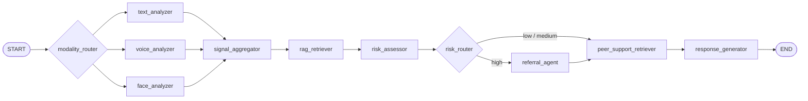

# 核心技术架构 Mermaid 源图

以下 Mermaid 图以当前仓库实现为准，主要对应：

- `app/graph/workflow.py`
- `app/graph/routers.py`
- `app/api/routes/chat.py`
- `app/api/routes/ws_chat.py`
- `app/services/asr_service.py`
- `app/services/trace_service.py`

---

## 精简版

---

## 完整版

```mermaid
flowchart LR
    subgraph Client["交互入口"]
        WebText["Web 前端文本输入"]
        WebVoice["Web 前端语音输入"]
        External["外部系统 / 调试客户端"]
    end

    subgraph API["FastAPI 接口层"]
        ChatRoute["POST /chat"]
        WsChat["WS /ws/chat/{session_id}"]
        WsVoice["WS /ws/voice-chat/{session_id}"]
    end

    subgraph VoiceIngress["语音入口预处理"]
        PCM["PCM Chunk 输入"]
        Transcriber["PCMChunkAudioTranscriber"]
        Whisper["faster-whisper ASR"]
        Acoustic["AcousticFeatureExtractor"]
        E2VIngress["emotion2vec segment inference"]
        Segment["VoiceSegmentResult / voice_segments"]
    end

    subgraph StateLayer["状态与会话层"]
        Init["build_initial_state"]
        State["PsychologyGraphState"]
        Checkpoint["Checkpointer\nmemory / file"]
    end

    subgraph Graph["LangGraph 多智能体工作流"]
        Router{"modality_router"}
        Text["text_analyzer"]
        Voice["voice_analyzer"]
        Face["face_analyzer"]
        Aggregate["signal_aggregator"]
        RAG["rag_retriever"]
        Risk["risk_assessor"]
        Decision{"risk_router"}
        Referral["referral_agent"]
        Peer["peer_support_retriever"]
        Response["response_generator"]
    end

    subgraph Support["外部能力 / 辅助服务"]
        RagStore["RAGFlow / 相似案例库"]
        E2V["emotion2vec_plus_large"]
        Alert["Counselor Alert Webhook"]
        Trace["build_trace_payload"]
    end

    subgraph Output["系统输出"]
        Reply["reply / token stream"]
        Hotline["hotline_card"]
        TraceOut["trace / trace_id"]
        AlertOut["alert_status"]
    end

    WebText --> ChatRoute
    WebText --> WsChat
    WebVoice --> WsVoice
    External --> ChatRoute
    External --> WsChat

    WsVoice --> PCM --> Transcriber
    Transcriber --> Whisper
    Transcriber --> Acoustic
    Transcriber --> Segment
    Segment --> E2VIngress
    E2VIngress -.调用.-> E2V

    ChatRoute --> Init
    WsChat --> Init
    WsVoice --> Init
    Segment --> Init
    Init --> State
    State <--> Checkpoint

    State --> Router
    Router --> Text
    Router --> Voice
    Router --> Face
    Text --> Aggregate
    Voice --> Aggregate
    Face --> Aggregate
    Aggregate --> RAG
    RAG -.检索.-> RagStore
    RAG --> Risk
    Risk --> Decision
    Decision -->|high| Referral
    Decision -->|low / medium| Peer
    Referral --> Alert
    Referral --> Peer
    Peer -.检索.-> RagStore
    Peer --> Response

    Voice -.深度 SER.-> E2V
    Response --> Reply
    Response --> Hotline
    Response --> Trace
    Risk --> Trace
    Voice --> Trace
    Referral --> AlertOut
    Trace --> TraceOut
```

