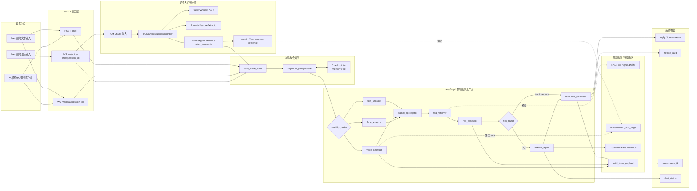

# 面向高校学生心理风险早期识别与转介辅助的多智能体协同系统

## 项目介绍白皮书

版本：V1.0  
日期：2026-03-25  
文档定位：校内试点 / 立项汇报 / 跨团队项目介绍  
代码基线：`main` 分支，标签 `prepilot-emotion2vec-integration`

---

## 摘要

本项目是一套面向高校场景的多智能体心理风险早期识别与转介辅助系统，目标是围绕学生日常文本与语音交互信号，提供非诊断性的风险识别、温和回应、规范转介与辅导员告警能力。系统不替代心理咨询师，不输出医学诊断结论，不提供治疗方案，而是服务于“早发现、早响应、早转介”的校园支持闭环。

截至 2026 年 3 月 31 日，项目已完成从线性单链路原型向 LangGraph 多智能体并行架构的升级，后端已落地 8 节点图拓扑、文本与语音并行分析、条件转介、RAG 检索增强、单机会话恢复、REST 与 WebSocket 双接口，以及 React 前端联调原型。仓库当前自动化测试共 109 个 Pytest 用例，实测全部通过，表明该系统已具备“可联调、可演示、可持续硬化”的试点前工程基础。

---

## 1. 项目背景与建设目标

高校学生心理风险通常具有表达碎片化、求助延迟、场景分散和响应链条长等特点。传统人工筛查方式在面对高并发日常咨询、匿名在线交流、夜间风险表达和跨渠道线索整合时，容易出现发现不及时、分级不一致和转介执行不规范的问题。

本项目的建设目标不是替代人工判断，而是建立一套可嵌入校园服务流程的智能辅助底座，重点解决以下问题：

1. 在学生主动表达时，快速提取文本与语音中的风险相关线索。
2. 将多模态观察结果汇聚为统一风险视图，避免单一线索过度放大。
3. 在高风险场景下，强制进入转介链路，输出更具同理心的过渡话术与求助资源卡片。
4. 为辅导员或后台系统提供脱敏告警能力，形成从识别到转介的最小闭环。
5. 通过工程化的图状态、测试与降级机制，确保系统在外部依赖波动时仍能稳定运行。

---

## 2. 项目定位与范围边界

### 2.1 项目定位

本系统定位为“高校心理风险早期识别与转介辅助系统”，适合用作：

- 校内心理支持平台的智能前置入口
- 学生在线表达场景中的风险筛查辅助层
- 辅导员或心理中心后台的风险会话预警工具
- 多模态心理支持研究和试点验证平台

### 2.2 明确边界

当前仓库和系统规则明确坚持以下边界：

- 不做医学或临床诊断
- 不输出治疗方案或药物建议
- 不承诺替代专业心理咨询
- 不在当前阶段承诺真实人脸模型上线
- 不将语音声学特征或单一模型结果直接等同于高风险判定

高风险判定必须经过风险评估节点与转介节点，不允许绕过 `risk_assessor -> referral_agent -> response_generator` 链路。

---

## 3. 系统总体方案

### 3.1 业务闭环

系统围绕一次学生交互建立最小闭环：

1. 接收文本消息或语音流输入。
2. 根据输入模态自动触发文本、语音、面部分析节点。
3. 汇聚多模态观察结果，并结合相似案例检索结果进行风险评估。
4. 对低、中风险场景输出温和支持性回复。
5. 对高风险场景强制触发转介节点，生成支持资源卡片并异步发送脱敏告警。

### 3.2 当前输入与输出

当前实现已支持以下输入接口：

- REST：`/chat`
- WebSocket 文本流：`/ws/chat/{session_id}`
- WebSocket 语音流：`/ws/voice-chat/{session_id}`

系统当前可稳定输出：

- 中文温和回复文本
- `risk_level`：`low | medium | high`
- `referral_required`
- `hotline_card`
- `trace_id`
- `trace` 解释性信息
- 告警执行状态 `alert_status`

---

## 4. 核心技术架构

### 4.1 多智能体图拓扑

项目已完成从线性流程向 LangGraph 多智能体 Fan-out / Fan-in 拓扑的重构。当前图中落地的核心节点为：

- `text_analyzer`
- `voice_analyzer`
- `face_analyzer`
- `signal_aggregator`
- `rag_retriever`
- `risk_assessor`
- `referral_agent`
- `response_generator`

当前实际工作流如下：

这一设计已经具备三个关键价值：

- 模态分析解耦，便于独立扩展或替换单个分析器。
- 聚合节点统一对下游暴露 `extracted_signals`，降低节点间耦合。
- 高风险转介由条件路由强制约束，减少业务逻辑绕行风险。

### 4.2 状态管理与并发安全

系统采用显式共享状态 `PsychologyGraphState` 管理会话上下文、多模态输入、分析结果、风险评分、告警状态与审计信息。为适应并行节点写入场景，仓库实现了自定义 `merge_dicts` reducer，用于安全合并 `agent_judgments`，避免 Fan-out 期间并发写入冲突。

项目同时抽离了 `app/utils/state_helpers.py`，统一处理：

- 最近一轮用户消息提取
- 初始状态构建
- Agent judgment 合并

项目也已将 LLM 节点的系统提示词常量与 user prompt builder 收敛到 `app/prompts/`，当前主流程中的 `text_analyzer`、`voice_analyzer`、`risk_assessor`、`response_generator` 以及兼容旧节点 `information_extractor` 均通过统一入口取用 prompt。这样做的价值在于：

- 节点代码只保留状态提取与业务决策，减少提示词散落带来的维护成本
- 安全审查、版本比较和后续 prompt 调优有了单一入口
- 兼容旧节点时不再需要复制一份近似提示词，降低漂移风险

这意味着当前图结构已经不是“把函数串起来”的原型，而是具备可维护状态契约的工程化实现。

### 4.3 会话记忆与持久化

项目当前已支持两类 checkpointer：

- `memory`：开发与测试默认方案
- `file`：本地磁盘持久化，可支持单机重启后的会话恢复

同时，`postgres` 与 `redis` 已作为接口层预留，但当前仓库尚未安装对应 LangGraph saver 扩展，因此生产级多实例持久化仍属于下一阶段工作。

---

## 5. 多模态识别能力现状

### 5.1 文本分析能力

`text_analyzer` 已完成以下能力：

- 提取情绪关键词
- 生成情绪倾向和文本观察项
- 在 LLM 不可用时，使用关键词规则兜底
- 将文本结果写入独立的 `text_signals`

当前文本链路的设计特点是“LLM 可参与，但不构成唯一依据”。这为后续模型替换提供了灵活性，也降低了外部模型波动对主流程的影响。

### 5.2 语音分析能力

语音链路是当前项目中完成度最高、工程特征最鲜明的部分之一。`voice_analyzer` 已实现：

- 原始音频解析与多路径输入兼容
- 声学物理特征提取，包括 F0、RMS、停顿等指标
- MFCC 特征提取，为后续 SER 扩展预留接口
- 基于规则的声学观察项抽取
- 启发式情绪推断
- 面向 LLM 的结构化声学解释提示
- `emotion2vec_plus_large` 本地推理增强
- 在缺少原始音频、模型目录缺失或推理失败时的结构化降级

项目对 CPU 密集的音频处理使用 `asyncio.to_thread()` 下沉到线程，避免阻塞 FastAPI 和 WebSocket 事件循环，符合异步服务的工程要求。

### 5.3 emotion2vec 增强能力

当前仓库已经接入可选的 `emotion2vec_plus_large` 本地推理服务，能力状态如下：

- 启用时，可对原始音频做 utterance 级情绪分类
- 输出包括 `emotion_label`、`confidence`、`topk` 和 `observation`
- 结果写入 `voice_signals["emotion2vec_reading"]`
- 状态摘要会进一步写入 `trace.emotion2vec`，供前端直接观察当前推理状态
- 不替代原有声学特征链路，只作为并行增强信号
- 当功能关闭、模型缺失、依赖不足或推理失败时，返回 `disabled`、`unavailable` 或 `error` 状态

在已完成本地模型目录挂载的环境中，该链路已经通过实际推理验证，能够返回 `ok` 状态与情绪标签结果。

这说明当前语音能力并非单一“模型接入”，而是形成了传统声学链路与深度 SER 增强并存的双轨结构。

### 5.4 面部信号能力

`face_analyzer` 当前已接入前端传入的面部 JSON 特征，并将情绪标签映射为辅助观察项，但仍属于占位实现。现阶段它的主要价值是：

- 证明模态路由与独立节点机制已经打通
- 为未来接入视频理解或表情识别模型预留接口
- 明确其只作为辅助观察，不作为风险唯一依据

因此，项目当前已经具备“文本 + 语音可用、面部可扩展”的多模态底座。

---

## 6. 风险评估与转介闭环

### 6.1 风险评估机制

`risk_assessor` 当前采用“规则兜底 + LLM 评估 + 声学轻度校准”的混合机制：

- 对高风险关键词和变体表达进行严格黑名单匹配
- 对一般负性情绪采用低、中风险区分
- 对 LLM 误判高风险场景设置严格约束，只有在文本证据充分时才允许 high
- 将声学观察结果仅作为轻度校准因子，不允许单独推导高风险
- 结合 RAG 相似案例作为参考上下文，但外部检索失败不会中断流程

这套机制体现出较强的安全意识：高风险必须有明确文本证据，语音和模型只能辅助，不可替代安全规则。

### 6.2 转介与告警闭环

`referral_agent` 已承担以下职责：

- 在高风险时生成温和、同理心较强的转介过渡语
- 输出热线卡片 `hotline_card`
- 触发同步 + 异步双保险的 webhook 告警
- 对告警会话标识进行哈希脱敏

与许多只返回“请联系热线”的冷模板系统不同，当前实现把高风险闭环拆成两个层次：

- 前端对学生输出更自然的支持性过渡
- 后台对管理侧输出结构化、脱敏的高风险摘要

这使系统更适合高校场景中的“温和响应 + 规范上报”双重要求。

---

## 7. RAG、可解释性与可观测能力

### 7.1 RAG 检索增强

系统已具备独立 `rag_retriever` 节点，可对接 RAGFlow 相似案例库，实现：

- 按用户最新一轮表达检索历史相似案例
- 将结果作为 `reference_context` 注入风险评估节点
- 在外部依赖不可用时自动降级为空上下文

这意味着项目已具备“可接知识库”的结构，而不是纯 Prompt 驱动的对话机器人。

### 7.2 可解释性 Trace

项目已经实现 `trace` 解释性信息组装，当前能够输出：

- 最近语音片段信息
- 声学观察项
- emotion2vec 当前状态、标签、置信度、模型目录和错误信息
- 风险基础分与校准后分数
- 是否使用声学调整
- 各 Agent 的内部判断 `agent_judgments`

前端已内置 Trace 面板，用于展示音频片段、支持等级、风险校准、emotion2vec 当前状态和声学线索。这使系统在联调和试点阶段具备一定程度的过程透明度，有助于减少“黑箱感”。

---

## 8. 前端原型与交互体验现状

项目当前已经配套 React + Vite + TailwindCSS 前端原型，完成的能力包括：

- 文本输入与对话消息流呈现
- 语音录制、16kHz PCM 下采样与实时发送
- 文本 WebSocket 与语音 WebSocket 双通道联动
- 阶段状态提示，如接收、检索、评估、生成回复等
- 最新转写结果展示
- Trace 调试侧栏
- 高风险支持卡片渲染

从工程角度看，前端并不是静态展示页，而是已经与后端事件流协议对接的联调原型。它足以支撑校园试点前的产品演示、流程评审和体验验证。

---

## 9. 工程成熟度评估

### 9.1 当前验证结果

截至本次仓库更新时，仓库实测结果如下：

- Pytest 自动化测试总数：109
- 测试结果：109 通过
- 本次验证耗时：7.42 秒

测试覆盖内容已包括：

- Graph 编译与整图运行
- 多轮会话记忆恢复
- 高风险后续轮次回归低风险的边界
- 文本与语音 WebSocket 事件序列
- 路由规则
- 各独立节点的降级路径
- 集中 prompt 管理与节点 prompt builder 接入
- `emotion2vec` 服务的关闭、缺失、成功、异常等分支
- WebSocket `final.trace` 中 emotion2vec 状态暴露
- 配置与 checkpoint 工厂

### 9.2 当前阶段判断

结合代码实现和测试状态，本项目当前更适合定义为：

**试点前版本 / 可联调验证版本 / 可继续硬化的工程原型**

这意味着：

- 已经超过“概念验证”阶段
- 尚未达到“校内生产稳定运行”阶段
- 具备进入小范围试点准备期的技术基础

---

## 10. 安全、合规与治理原则

系统当前设计已明确体现以下治理原则：

### 10.1 非诊断原则

无论是文本分析、语音情绪观察还是回复生成，系统都被约束为：

- 输出客观观察
- 输出支持性回应
- 输出风险等级与转介建议
- 不输出诊断标签
- 不输出治疗方案

### 10.2 高风险强制转介

只要风险等级为 `high`，系统就必须进入 `referral_agent`。这一约束由图路由保证，而不是依赖前端或人工记忆执行。

### 10.3 敏感信息脱敏

告警服务对 `session_id` 做哈希掩码，只向外发送脱敏后的会话标识与摘要性信息，降低原始身份数据暴露风险。

### 10.4 依赖失败可降级

当前系统对以下外部能力都实现了安全降级：

- LLM 不可用
- RAGFlow 不可用
- Whisper 模型不可加载
- emotion2vec 模型不存在或依赖不完整

这对于校园试点阶段尤其重要，因为真实运行环境中最常见的问题不是算法本身，而是模型、网络和部署条件波动。

---

## 11. 当前不足与试点前待补项

虽然项目已经具备较扎实的原型基础，但若要进入真实校内试点，建议优先补齐以下几类能力：

### 11.1 持久化与多实例能力

当前 `file` checkpointer 适合单机验证，但不适合多实例、高可用或集中运维场景。下一步应接入：

- PostgreSQL 持久化 saver
- Redis 会话态协同
- 更完整的会话审计和回放机制

### 11.2 真实校园资源对接

当前热线卡片与 webhook 仍偏演示型，试点前应接入：

- 学校心理中心真实值班信息
- 辅导员或值班老师通知链路
- 告警事件编号、人工处理状态与回执机制

### 11.3 模型与安全策略硬化

尽管高风险策略已较严格，但试点前仍建议增加：

- 更细颗粒度的高风险规则审校
- Prompt 与输出审计记录
- 误报 / 漏报复盘机制
- 校内伦理与数据治理评审

### 11.4 前端产品化能力

当前前端已适合联调和演示，但要进入正式试点，仍需补足：

- 登录与角色权限
- 会话列表和告警看板
- 管理端处理闭环
- 更细粒度的埋点与性能监控

---

## 12. 下一阶段建议路线

建议将后续建设拆为三个阶段推进。

### 阶段一：试点前硬化

- 接入生产级 checkpoint 后端
- 完善告警落库与审计字段
- 梳理高风险人工处置 SOP
- 增加 CI、测试报告和部署脚本

### 阶段二：校内小范围试点

- 选择单院系或单渠道入口灰度接入
- 评估误报率、转介触达率和平均响应时延
- 建立人工复核台账

### 阶段三：能力扩展

- 接入本地大模型推理服务
- 引入更完整的视频或时序情绪建模
- 构建面向管理端的风险运营看板

---

## 13. 结论

综合当前代码实现、接口形态、测试结果和前端联调状态，本项目已经完成了从“心理支持对话原型”向“多智能体心理风险识别与转介辅助系统”的关键跨越。

它的优势不在于单一模型精度宣传，而在于已经建立起较完整的工程闭环：多模态输入、图式编排、风险评估、强制转介、脱敏告警、会话记忆、解释性 trace 与自动化测试。这使它具备进入校内试点准备阶段的现实基础。

与此同时，项目也清楚地保留了边界感：不做诊断、不假装生产就绪、不把占位节点写成已上线能力。这种克制对高校心理支持场景尤为重要。基于当前仓库状态，本项目适合作为学校心理支持数字化建设中的“智能辅助底座”继续推进。

---

## 附录 A：当前仓库事实快照

| 项目 | 当前状态 |
|------|---------|
| 后端框架 | FastAPI + LangGraph + LangChain |
| 前端框架 | React + Vite + TailwindCSS |
| 图节点数量 | 8 个核心节点 |
| 输入接口 | `/chat`、`/ws/chat/{session_id}`、`/ws/voice-chat/{session_id}` |
| 会话恢复 | `memory` / `file` checkpointer |
| RAG | 支持 RAGFlow，可降级 |
| 语音增强 | 支持可选 `emotion2vec_plus_large` |
| 面部能力 | 已打通接口，占位实现 |
| 高风险闭环 | 强制进入转介与 webhook 告警 |
| 自动化测试 | 109 个 Pytest 用例通过 |

## 附录 B：建议使用方式

本白皮书适用于以下场景：

- 校内项目立项或试点汇报附件
- 向心理中心、信息化部门、辅导员团队介绍系统能力
- 作为下一阶段产品化和部署方案讨论的背景材料

如需对外公开版本，建议再追加：

- 脱敏后的应用案例
- 更完整的部署拓扑图
- 数据治理与伦理审查说明
